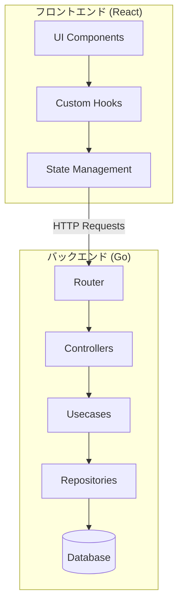
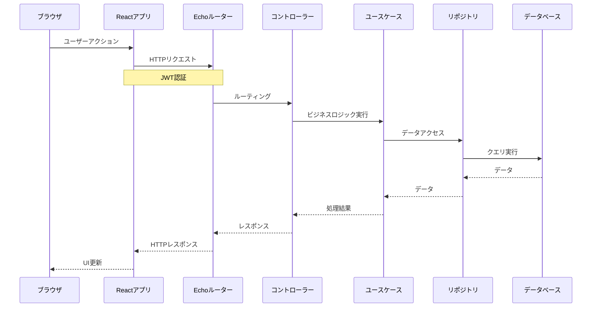
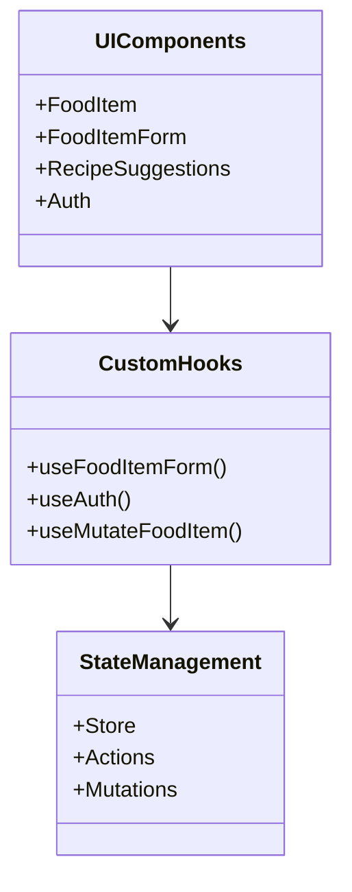
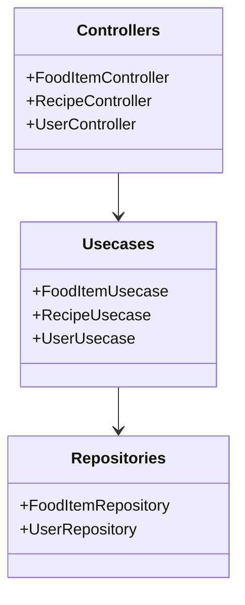
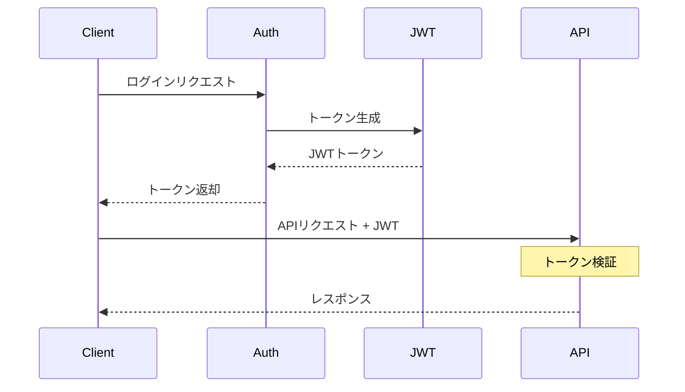
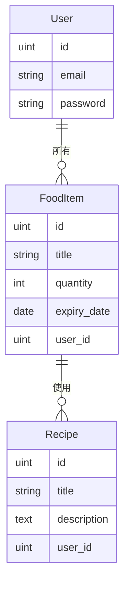
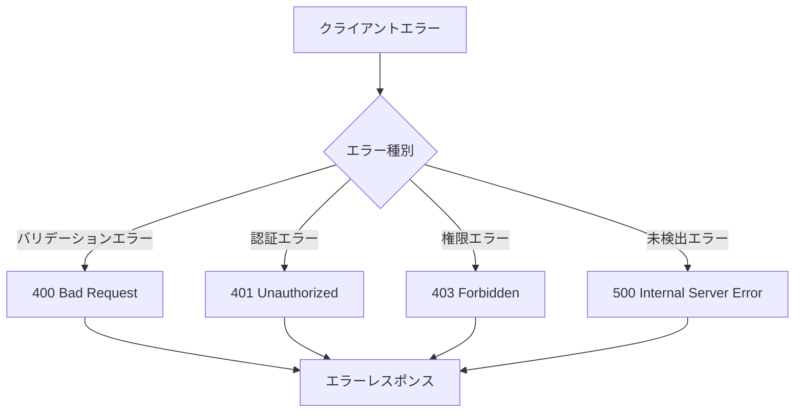
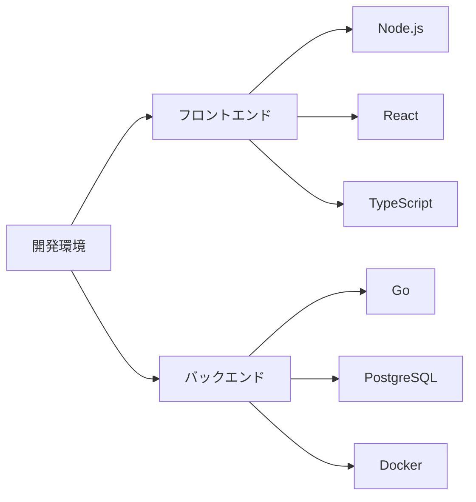
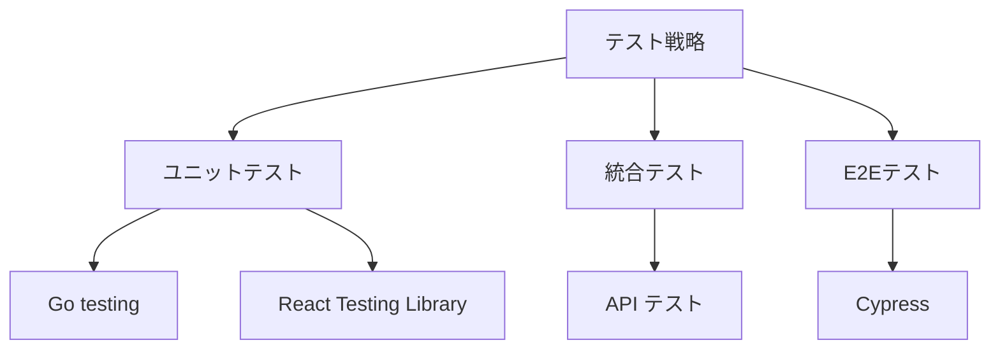
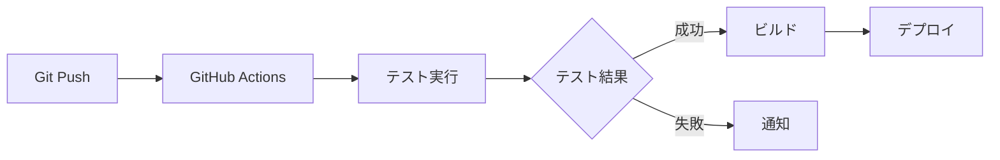

# スマートパントリーシステム - アーキテクチャ設計

## システム構成図

## リクエストフロー

## レイヤー構造

### 1. プレゼンテーション層 (React)

### 2. アプリケーション層 (Go)

## セキュリティ設計

### 認証フロー

## データモデル

### エンティティ関係図

## エラーハンドリング設計

## 開発環境構成

## テスト戦略

## デプロイメントフロー

